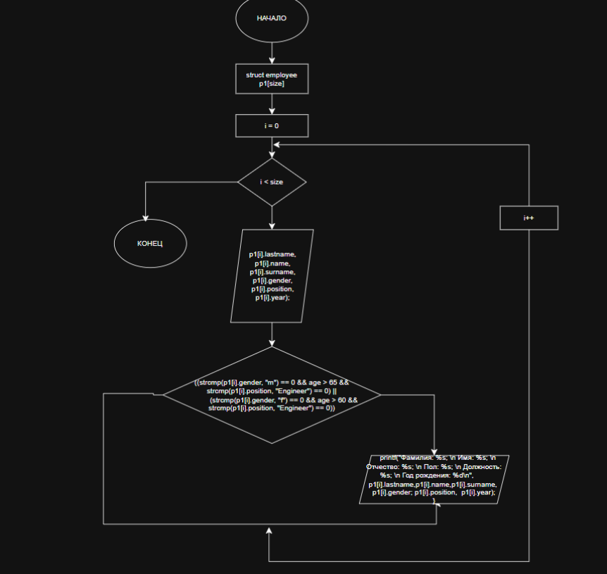
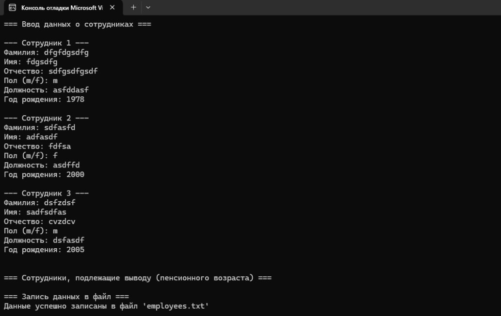

A# Домашнее задание к работе 19
## Условие задачи
 Реализуйте создание структуры, заполнение полей и вывод на экран. 
Вариант 6. Запись «Сотрудник»:
Фамилия
Имя
Отчество
Должность
Зарплата
Дата рождения
Вывести сведения о сотрудниках, которые родились в мае.

### Алгоритм
1.Начало программы 
2.Объявление переменных
    char lastname[20];
    char name[20];
    char surname[20];
    char position[20];
    float salary;
    char birth_date[11];  
3.Вычисления
 for (int i = 0; i < SIZE; i++) {
     printf("Сотрудник №%d:\n", i + 1);

     printf("  Фамилия: ");
     scanf("%19s", employees[i].lastname);

     printf("  Имя: ");
     scanf("%19s", employees[i].name);

     printf("  Отчество: ");
     scanf("%19s", employees[i].surname);

     printf("  Должность: ");
     scanf("%19s", employees[i].position);

     printf("  Зарплата: ");
     scanf("%f", &employees[i].salary);

     printf("  Дата рождения (ДД.ММ.ГГГГ): ");
     scanf("%10s", employees[i].birth_date);

     printf("\n");
 }

    for (int i = 0; i < SIZE; i++) {
       
        if (strstr(employees[i].birth_date, ".05.") != NULL) {
            printf("Сотрудник #%d:\n", i + 1);
            printf("  Фамилия:    %s\n", employees[i].lastname);
            printf("  Имя:        %s\n", employees[i].name);
            printf("  Отчество:   %s\n", employees[i].surname);
            printf("  Должность:  %s\n", employees[i].position);
            printf("  Зарплата:   %.2f\n", employees[i].salary);
            printf("  Дата рождения: %s\n", employees[i].birth_date);
            printf("\n");
            found = 1;
        }
    }

    if (!found) {
        printf("Сотрудников, родившихся в мае, не найдено.\n");
    }

    return 0;
}
4.Вывести результат
  
printf("\nСотрудники, родившиеся в мае\n\n");
Конец программы
### Блок-схема

## 2. Реализация программы:
#define _CRT_SECURE_NO_DEPRECATE
#define _CRT_SECURE_NO_WARNINGS
#include <stdio.h>
#include <locale.h>
#include <string.h>
#define SIZE 3

struct employee {
    char lastname[20];
    char name[20];
    char surname[20];
    char position[20];
    float salary;
    char birth_date[11];  
};
typedef struct employee employee;

int main()
{
    setlocale(LC_ALL, "RUS");
    struct employee employees[SIZE];

    printf("=== Ввод данных о сотрудниках ===\n\n");

    for (int i = 0; i < SIZE; i++) {
        printf("Сотрудник №%d:\n", i + 1);

        printf("  Фамилия: ");
        scanf("%19s", employees[i].lastname);

        printf("  Имя: ");
        scanf("%19s", employees[i].name);

        printf("  Отчество: ");
        scanf("%19s", employees[i].surname);

        printf("  Должность: ");
        scanf("%19s", employees[i].position);

        printf("  Зарплата: ");
        scanf("%f", &employees[i].salary);

        printf("  Дата рождения (ДД.ММ.ГГГГ): ");
        scanf("%10s", employees[i].birth_date);

        printf("\n");
    }

    
    printf("\n=== Сотрудники, родившиеся в мае ===\n\n");

    int found = 0;

    for (int i = 0; i < SIZE; i++) {
       
        if (strstr(employees[i].birth_date, ".05.") != NULL) {
            printf("Сотрудник #%d:\n", i + 1);
            printf("  Фамилия:    %s\n", employees[i].lastname);
            printf("  Имя:        %s\n", employees[i].name);
            printf("  Отчество:   %s\n", employees[i].surname);
            printf("  Должность:  %s\n", employees[i].position);
            printf("  Зарплата:   %.2f\n", employees[i].salary);
            printf("  Дата рождения: %s\n", employees[i].birth_date);
            printf("\n");
            found = 1;
        }
    }

    if (!found) {
        printf("Сотрудников, родившихся в мае, не найдено.\n");
    }

    return 0;
}
## 3. Результат работы программы

## 4. Информация о разработчике
Амелина Юлия, бИПТ-252
